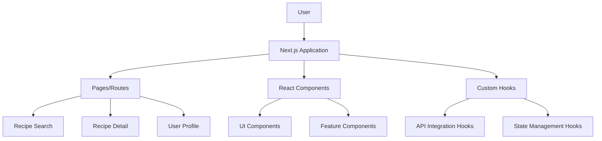
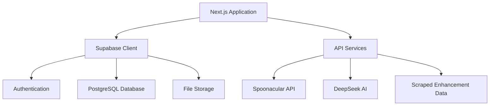
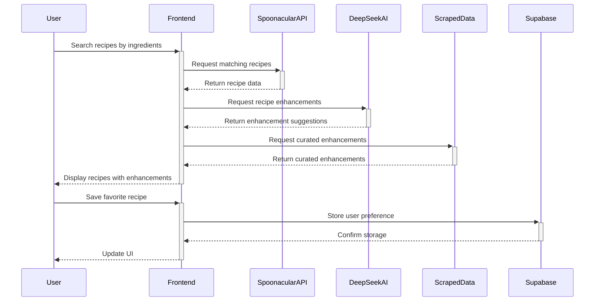

# PantryPal AI System Patterns

## System Architecture

PantryPal follows a modern web application architecture with the following key components:

### Frontend Architecture

### Backend Architecture

### Data Flow

## Key Technical Decisions

1. **Next.js Framework**
   - Provides server-side rendering for improved SEO
   - Enables API routes for backend functionality
   - Offers optimized image handling for recipe photos
   - Simplifies deployment with Vercel integration

2. **Supabase Backend**
   - Provides authentication system with multiple sign-in options
   - Offers PostgreSQL database for structured data storage
   - Includes real-time capabilities for future feature expansion
   - Reduces backend development complexity

3. **DeepSeek AI Integration**
   - Powers intelligent recipe enhancement suggestions
   - Enables personalization based on user preferences
   - Provides natural language processing for recipe understanding
   - Allows for continuous improvement through feedback

4. **Spoonacular API**
   - Provides comprehensive recipe database
   - Offers ingredient-based search functionality
   - Includes nutritional information and dietary tags
   - Reduces need for building and maintaining a recipe database

5. **Hybrid Enhancement Approach**
   - Combines AI-generated enhancements with human-curated suggestions
   - Enables comparison between AI and expert recommendations
   - Improves quality through continuous feedback
   - Creates a unique value proposition for users

## Design Patterns in Use

1. **Repository Pattern**
   - Abstracts data access logic
   - Centralizes API and database interactions
   - Improves testability and maintenance

2. **Component Composition**
   - Creates reusable UI building blocks
   - Enables consistent styling and behavior
   - Improves development efficiency

3. **Custom Hooks**
   - Encapsulates complex logic
   - Promotes code reuse across components
   - Separates concerns for better maintainability

4. **Service Layer**
   - Isolates external API interactions
   - Provides consistent error handling
   - Simplifies testing and mocking

5. **Feature Flags**
   - Enables gradual feature rollout
   - Facilitates A/B testing
   - Supports premium feature management

## Component Relationships

The application follows a hierarchical component structure with clear separation of concerns:

1. **Page Components**: Handle routing and overall layout
2. **Feature Components**: Implement specific functionality (search, enhancement, etc.)
3. **UI Components**: Provide reusable interface elements
4. **Service Modules**: Manage external API interactions
5. **Hook Modules**: Encapsulate reusable logic
6. **Utility Functions**: Provide helper functionality

This architecture enables efficient development, testing, and maintenance while supporting the application's core features and future expansion.
